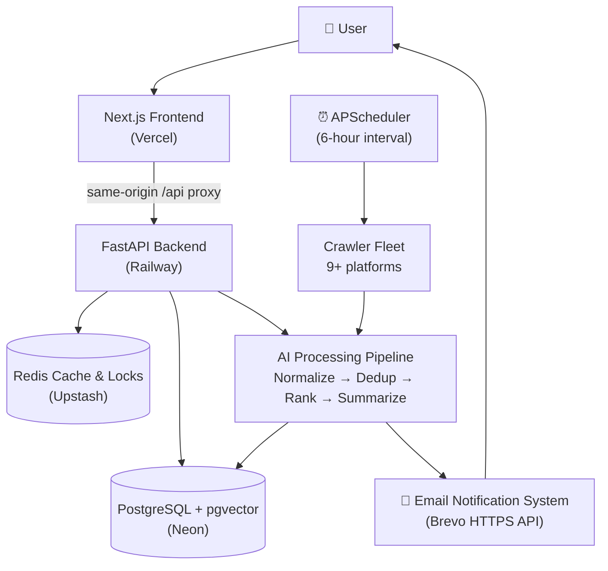
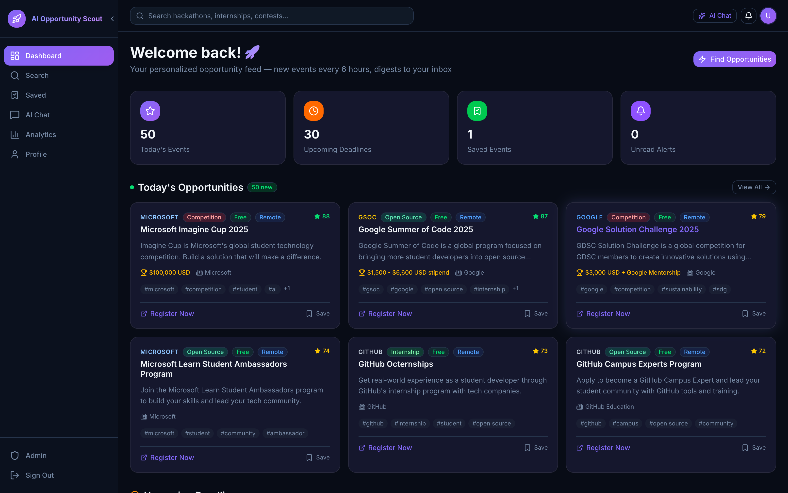
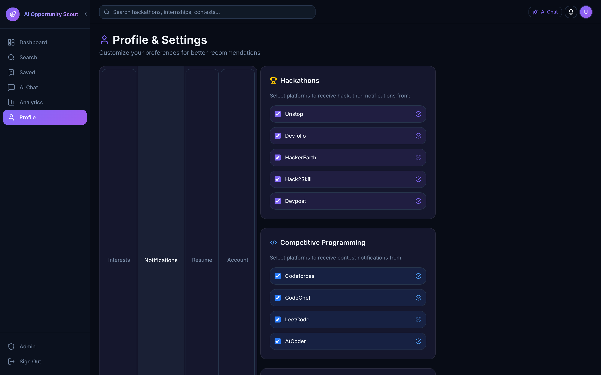
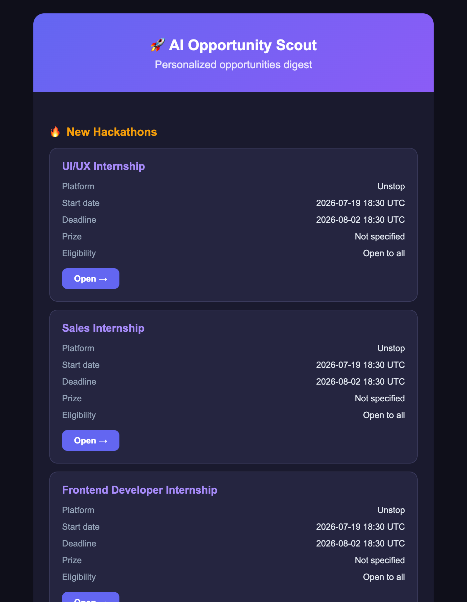

<div align="center">

# 🚀 AI Opportunity Scout

### *An AI-powered platform that automatically discovers hackathons, coding contests, and developer opportunities — and delivers personalized notifications.*

[](https://ai-opportunity-scout-pi.vercel.app/)
[](https://ai-opportunity-scout-production.up.railway.app/health)

[](https://ai-opportunity-scout-pi.vercel.app/)
[](https://ai-opportunity-scout-production.up.railway.app/health)
[](https://www.python.org/)
[](https://nextjs.org/)
[](https://fastapi.tiangolo.com/)
[](https://neon.tech/)
[](LICENSE)

**[Live Demo](https://ai-opportunity-scout-pi.vercel.app/)** · **[API Health](https://ai-opportunity-scout-production.up.railway.app/health)** · **[Report Bug](https://github.com/challau/AI-Opportunity-Scout/issues)** · **[Request Feature](https://github.com/challau/AI-Opportunity-Scout/issues)**

</div>

---

## 💡 The Problem

Every week, thousands of hackathons, coding contests, internships, and open-source programs go live across a dozen disconnected platforms. Students miss most of them — not because they aren't looking, but because **the information is scattered**: Unstop, Devfolio, Codeforces, LeetCode, Devpost, and more, each with its own feed, format, and deadline system. By the time an opportunity surfaces in a WhatsApp group, registration has often closed.

## ⚡ The Solution

**AI Opportunity Scout** is a fully automated discovery engine. It continuously crawls 9+ platforms, normalizes every opportunity into a unified schema, eliminates duplicates with content hashing, ranks relevance with AI, and delivers **personalized email digests** — filtered by each user's chosen platforms — every 6 hours. No more tab-hopping. No more missed deadlines.

> **One URL. Every opportunity. Zero manual searching.**
>
> 🌐 **Try it now:** [ai-opportunity-scout-pi.vercel.app](https://ai-opportunity-scout-pi.vercel.app/)

---

## ✨ Product Features

### 🔍 Automated Opportunity Discovery

A resilient crawler fleet monitors both hackathon and competitive-programming ecosystems:

| 🔥 Hackathons | ⚔️ Competitive Programming |
|---|---|
| Unstop | Codeforces |
| Devfolio | CodeChef |
| HackerEarth | LeetCode |
| Hack2Skill | AtCoder |
| Devpost | |

Each crawler speaks the platform's native API (or falls back to structured scraping), retries with exponential backoff, and is isolated so one platform's failure never blocks the rest.

### 🤖 AI Pipeline

Every crawled opportunity flows through a six-stage pipeline before it ever reaches an inbox:

```
  Crawler  →  Data Normalization  →  Duplicate Detection  →  AI Ranking  →  Database Storage  →  Personalized Email
```

- **Normalization** — heterogeneous platform payloads are mapped to one unified event schema (title, deadline, prize, eligibility, registration URL)
- **Duplicate Detection** — SHA-256 content hashing on `title | platform | registration_url`, plus Jaccard title-similarity for fuzzy matches
- **AI Ranking** — events scored 0–100 using platform prestige, prize value, deadline proximity, and LLM-based relevance
- **Semantic Search** — 1536-dimension embeddings stored in **pgvector** power natural-language event discovery

### 🔔 Smart Notifications

Users are in full control:

1. **Create an account** in seconds
2. **Select preferred platforms** — any mix of the 9 sources
3. **Enable the 6-hourly digest** with one toggle
4. **Receive personalized emails** containing only *new* events matching *their* platforms — never repeats, never spam

### 🏭 Production Features

✅ JWT authentication with refresh-token rotation &nbsp;·&nbsp; ✅ User profiles & notification preferences
✅ Distributed background scheduler (Redis-locked, redeploy-safe) &nbsp;·&nbsp; ✅ Email automation via HTTPS API
✅ PostgreSQL persistence with self-healing migrations &nbsp;·&nbsp; ✅ Redis caching & rate limiting
✅ Hash-based duplicate prevention &nbsp;·&nbsp; ✅ 40+ documented REST endpoints &nbsp;·&nbsp; ✅ Zero-downtime cloud deployment

---

## 🏗️ Architecture



**Key engineering decisions**

- **Single public URL** — the frontend proxies all API calls through Next.js rewrites, so the backend stays hidden and client-side CORS/DNS issues disappear entirely
- **Redis-locked scheduler** — distributed locking guarantees exactly one scheduler instance across redeploys, with automatic stale-lock takeover
- **HTTPS email delivery** — transactional email rides over port 443 (Brevo REST API) because PaaS providers block outbound SMTP; the service degrades gracefully to SMTP elsewhere
- **Self-healing schema** — startup diffs SQLAlchemy models against the live database and applies additive migrations automatically, so model changes deploy without manual intervention
- **Fail-open startup** — Redis down? Scheduler stands by. OpenAI key absent? Search falls back to keyword ranking. The `/health` endpoint answers in milliseconds regardless

---

## 🛠️ Technology Stack

| Layer | Technologies |
|---|---|
| **Frontend** | Next.js 16 · React 19 · TypeScript · Tailwind CSS · Framer Motion · TanStack Query |
| **Backend** | FastAPI · Python 3.12 · SQLAlchemy 2.0 (async) · Alembic · APScheduler · Pydantic v2 |
| **Database** | PostgreSQL (Neon serverless) · pgvector for semantic embeddings |
| **Infrastructure** | Vercel · Railway · Neon · Upstash Redis |
| **AI** | LLM-based ranking · semantic embedding search · intelligent summarization · LangGraph agent pipeline |

---

## 📸 Screenshots

### Dashboard


### Notifications


### Email Alerts


---

## 📚 API Documentation

Interactive Swagger documentation ships with the backend:

```
https://ai-opportunity-scout-production.up.railway.app/docs
```

**Health check**

```http
GET /health
```

```json
{
  "status": "healthy",
  "app": "AI Opportunity Scout",
  "version": "1.0.0"
}
```

**Highlights from 40+ endpoints**

| Endpoint | Purpose |
|---|---|
| `POST /api/auth/register` · `POST /api/auth/login` | JWT authentication |
| `GET /api/events` | Paginated, filterable opportunity feed |
| `POST /api/search/semantic` | pgvector-powered natural-language search |
| `PATCH /api/users/me/profile` | Platform & notification preferences |
| `GET /api/scheduler/status` | Live scheduler telemetry (`running`, `last_run`, `next_run`, `emails_sent`) |
| `POST /api/ai/chat` | AI assistant for opportunity discovery |

---

## ⚙️ Installation

**1 — Clone the repository**

```bash
git clone https://github.com/challau/AI-Opportunity-Scout.git
cd AI-Opportunity-Scout
```

**2 — Frontend dependencies**

```bash
cd frontend
npm ci
```

**3 — Backend dependencies**

```bash
cd ../backend
python -m venv .venv && source .venv/bin/activate
pip install -r requirements.txt
```

**4 — Environment variables**

```bash
cp .env.example .env
# Fill in: DATABASE_URL, REDIS_URL, SECRET_KEY, BREVO_API_KEY (email), OPENAI_API_KEY (optional)
```

**5 — Database migration**

```bash
sh migrate.sh   # waits for DB, enables pgvector, syncs schema, stamps Alembic
```

**6 — Run locally**

```bash
# Terminal 1 — backend
uvicorn app.main:app --reload --port 8000

# Terminal 2 — frontend
cd frontend && npm run dev
```

Open `http://localhost:3000` — the frontend proxies API calls to the backend automatically.

---

## ☁️ Deployment Architecture

| Component | Platform | Notes |
|---|---|---|
| **Frontend** | Vercel | Edge-deployed Next.js; rewrites proxy `/api/*` to the backend so users only ever see one domain |
| **Backend** | Railway | Dockerized FastAPI; binds `0.0.0.0:$PORT`; `/health`-gated deployments with automatic rollback |
| **Database** | Neon | Serverless PostgreSQL with pgvector; connection retry logic absorbs cold starts |
| **Cache & Locks** | Upstash | Serverless Redis over TLS; rate limiting + distributed scheduler locking |

Deploys are fully automated: `git push` → Railway builds the Docker image, runs schema sync, and swaps traffic only after the health check passes, while Vercel builds and aliases the frontend in parallel.

---

## 🎯 Why This Project Is Different

- **Solves a real student problem** — built from the lived frustration of missed deadlines, not a tutorial
- **AI instead of manual searching** — ranking, dedup, and summarization replace hours of tab-hopping per week
- **Actually in production** — live URL, real users, real emails, health-gated deploys; not a localhost demo
- **Multi-source aggregation** — 9+ platforms unified into one schema and one feed
- **Automated end-to-end** — from crawl to inbox with zero human intervention, every 6 hours
- **Scalable architecture** — stateless API workers, serverless data tier, and a lock-coordinated scheduler that scales horizontally

---

## 🗺️ Roadmap

- [ ] **AI career recommendations** — long-term opportunity pathing based on profile and history
- [ ] **Resume matching** — parse resumes and auto-match to eligible opportunities
- [ ] **Internship discovery** — dedicated internship crawlers and filters
- [ ] **Mobile application** — React Native companion app
- [ ] **WhatsApp / Telegram alerts** — notification channels beyond email
- [ ] **Team formation** — matchmaking for hackathon teammates by skills and time zone

---

## 👨‍💻 Built By

**Challa Uday Kumar**
B.Tech Computer Science Engineering · Dayananda Sagar University

Passionate about:

`Artificial Intelligence` · `Competitive Programming` · `Full Stack Development` · `Cloud Engineering`

[](https://github.com/challau)

---

<div align="center">

**⭐ If this project helped you discover an opportunity, consider giving it a star!**

*Built with FastAPI, Next.js, and an unreasonable dislike of missed deadlines.*

</div>
